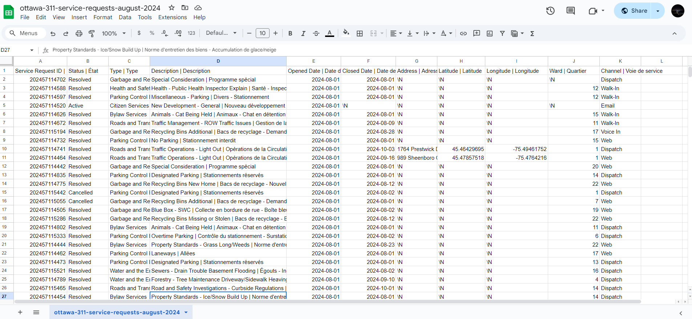
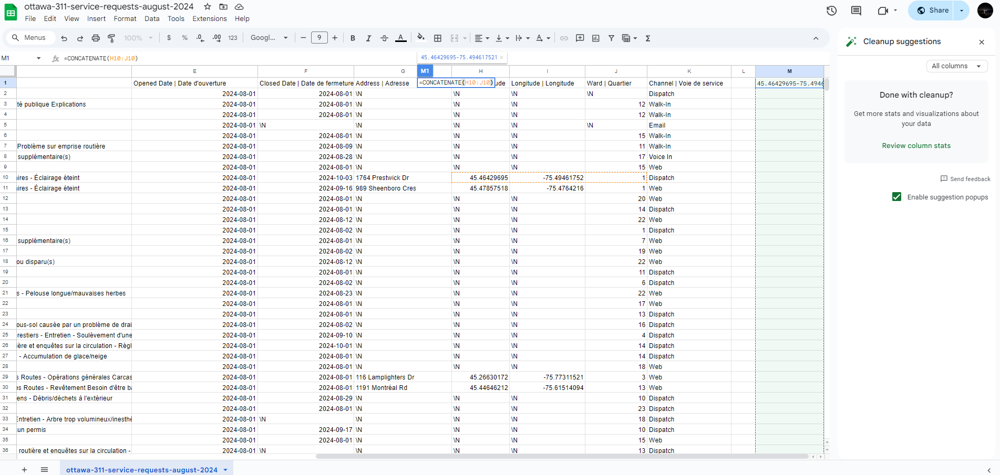
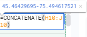
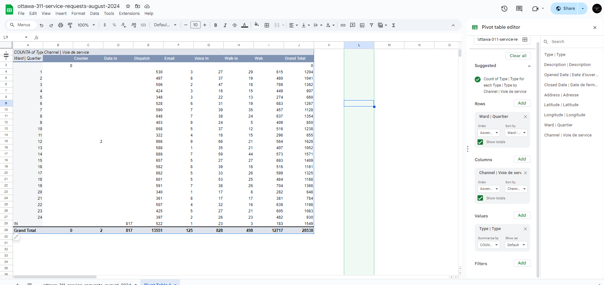
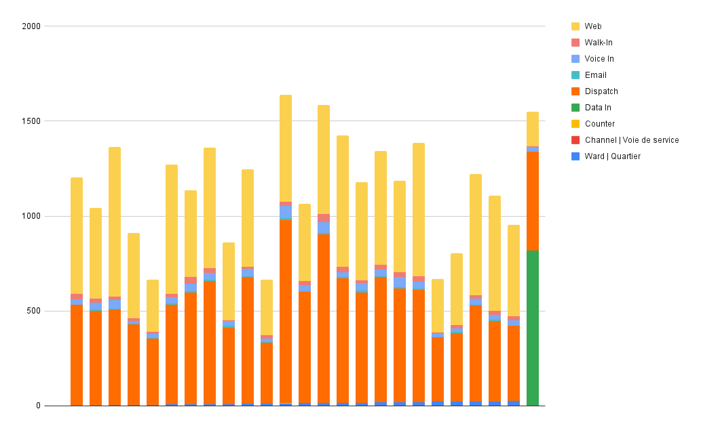

**November 4th, 2024** 
**MPAD 2003 A Fall, Introductory Data Storytelling** 
**Hafsa Nachete** 
**Presented to Jean-Sébastien Marier** 

# Midterm Project: Exploratory Data Analysis (EDA)

## Foreword

I will examine a portion of the "2024 Service Requests" dataset from the city of Ottawa. My goal is to uncover a meaningful narrative / story that reflect the community's ingeactions with services. I look forward to sharing my process throughout this assignment.

## 1. Introduction

As mentioned in the foreword, I will be analyzing a dataset from the City of Ottawa that focuses on service requests made by residents in August 2024. These requests cover non-emergency issues such as road repairs, waste collection, and bylaw enforcment. The dataset provides detailed records of 311 service requests, including the type of service requested, the submission date, location, and status updates. The original dataset can be accessed on [Open Ottawa](https://open.ottawa.ca/documents/65fe42e2502d442b8a774fd3d954cac5/about), with a CSV version available on the [Github portal](https://raw.githubusercontent.com/jsmarier/course-datasets/refs/heads/main/ottawa-311-service-requests-august-2024.csv). 

This report consists of four main sections. First, getting data, I will explain how the dataset was imported into Google Sheets and provide initial observations about its structure and content. Second, in Understanding data, I will perform a VIMO analysis to evaluate the data's quality, followed by data cleaning and exploratory analysis to uncover patterns. Thrid, I will explore potential stories from the dataset. Finallly, in the conclusion, I will reflect on the challenges, insights, and key takeaways from ompleting the analysis. 

## 2. Getting Data

To obtain the necessary data, I began by importing the dataset into Google Sheets. The involved downloading the CSV file from the Github portal. In Google Sheets, I selected "file", then "Import", followed by "Upload" to add my CSV file. After the import, I adjusted the settings to set the delimiter to "Comma", ensuring the columns would displayed correctly. 

You can see a results of this process in the screenshot below and in the attached [Google Sheet](https://docs.google.com/spreadsheets/d/1BZ9UBwwG1Ge7Uvxf2ftSpjDnVnBD0zheKhyqrZ12peE/edit?usp=sharing) link: 

 
*Figure 1: Screenshot of the import process in Google sheets* 

In general observations, the dataset includes 11 columns and 28,539 rows. The column headings provide information such as the status of the request, the type, a description, the opened and closed dates, the adress, latitude, lontitude, the ward, and the channel through which the request was made. At first glance, the data appears to be relatively clean, with no significant issues like missing headers or misplaced information in the wrong columns. 

In terms of specific observations, Column C represents the type of request made, categorized as nominal variables.The data shows 5 caegories:"Garbagde and Recycling", "Bylaw services", "Roads and Transportation", "Water and the Environment" and finally "Parking Control Enforcment". Garbadge and Recycling" seems to be the most in frequency levels, while "Parking Control Enforcment" has the lowest frequency of requests. 

For column D, which describes the service requests in more detail, the most frequent description is related to "Organics - SWC" (Source Waste Collection).

Regarding Column F (Opening Date) and Column G (Closing Date), a significant number of closing dates are marked as "\N," indicating missing data. However, among the completed requests, many were closed on August 28, 2024, while a high number of cases were opened on August 29, 2024, which is an interesting trend to note.

In Column G (Address of Request), the most common entry is "\N," indicating missing data for many records. However, the address "99 Cobourg St" appears 18 times, followed closely by "1000 Airport Parkway Priv" with 11 occurrences.

Looking at Column J (Ward), the highest number of service requests originated from Ward 12 (Rideau-Vanier) and Ward 14 (Somerset).

For Columns H and I (Latitude and Longitude), the majority of geolocated requests are associated with "Roads and Transportation" (4,214 occurrences), with a smaller number linked to "Recreation and Culture" (844 occurrences).

Lastly, in Column K (Channels), most requests were made through dispatch services (13,551 instances), followed by web submissions (12,717), and voice-ins (828). The least common channels were data-in (817) and walk-in requests (498).

### The Hypothesis
The question that comes to mind is wherther certain wards in Ottawa have a higher frequency of service requests than others. In praticular, does Ward 12 (Rideau-Vanier) consistently report more service requests compraed to other wards, and if so, what might be the reason for this?

## 3. Understanding Data

### 3.1. VIMO Analysis

I will focus on three key columns for my VIMO analysis: "Column J: Ward," "Column C: Type of Requests," and "Column K: Channels."

In Column J, there are numerous values marked as "\N," indicating missing data. The absence of ward information could hinder the reader's ability to accurately assess the distribution of service requests[(Statistics Canada, 2020)
](https://apastyle.apa.org/style-grammar-guidelines/citations). Additionally, Ward 12 has significantly more requests, standing out as an outlier due to its exceptionally high volume compared to other wards [(Statistics Canada, 2020)
](https://apastyle.apa.org/style-grammar-guidelines/citations). 

In Column C, it's crucial to verify the consistency of service request types. After reviewing the column statistics, there should not be many unique values, as the main categories of requests should appear repeatedly in a consistent manner. In Column K, there's another outlier: a disproportionately high number of requests made through the dispatch channel.

### 3.2. Cleaning Data

I implemented several cleaning methods on my data. First, I checked the cleanup suggestions in my sheets and identified an issue with whitespace in Column D. I made the necessary changes and trimmed all the extra whitespace as suggested.

Next, I froze Row C by navigating to the View menu, selecting the Freeze option, and choosing Column C.

Lastly, I used the CONCATENATE function in cell M1 to combine the contents of H10 and J10.

Here are screenshots of the results: 

 
 
*Figure 2: Cleaned Data Sheet* 

### 3.3. Exploratory Data Analysis (EDA)

I chose to analyze the frequency of service requests by ward because it provides insights into where the demand for services is highest in Ottawa. Understanding this aspect helps identify areas that may need more resources or attention.

As I reviewed the table, I found it interesting that Ward 12 was the only one with two data-in channels, and it had the highest numbers in dispatch, email requests, and voice-ins. However, it did not rank first in walk-ins or web requests. This suggests a particular demographic in Ward 12 is more likely to make calls through these channels. In the next step, I want to investigate which ward makes the fewest calls, how they make them when they do, and the reasons behind that.

I didn’t find much information about the residents of Rideau-Vanier, but I did come across a few articles that might suggest a potential story. There seems to be a lack of economic progress in that area, with reports indicating that the housing market is struggling compared to other parts of Ottawa. It consistently ranks low in housing metrics, and the industry and high-tech sectors have largely overlooked the district (Bagnall, 2017).

Another interesting factor that may explain the high number of calls from this ward is the presence of a dedicated ward councillor who has lived there for over 20 years. The source indicates that she is actively involved in helping her community and is passionate about ensuring that the ward is safe and welcoming, making it comfortable for residents to walk around without concerns (La Ville d'Ottawa, n.d.).

The ward appears to lean toward a more conservative, closed-off atmosphere, which may be conducive to settling for older demographics.

**A screen capture of the pivot table:**

 
*Figure 2: This pivot table shows the corralation between the number of services request and specific wards.*

**A screen capture of the exploratory chart:**

 
*Figure 3: This exploratory chart shows the corralation between the number of services request and specific wards.*

## 4. Potential Story

The potential story revolves around the significant presence of an older demographic in Ward 12, which influences the way service requests are made. Many of these residents may not be as comfortable using web-based services, making it more challenging for them to submit requests online. As a result, they tend to rely on phone calls and dispatch services, which could explain the higher frequency of service requests in these categories.

This situation highlights the barriers that older adults face when accessing services, revealing a need for more user-friendly options tailored to their preferences. It suggests that the local government and community organizations should consider initiatives aimed at improving digital literacy among seniors or providing more accessible alternatives for submitting requests.

Furthermore, the role of a dedicated ward councillor, who is active in the community and focused on ensuring a safe and welcoming environment, could be pivotal in addressing these issues. Her efforts may help bridge the gap for elderly residents, ensuring they receive the support they need without the additional hurdles of technology or transportation.

## 5. Conclusion

In conclusion, I've gained valuable experience in the journalistic process of extracting an engaging story from numbers and data logs. This assignment certainly presented its own set of challenges, particularly in creating exploratory charts and visualizing the information. The most rewarding moment was when I finally understood the correlation and saw the insights I could draw from the data. Moving forward, I would encourage myself to conduct more research on the correlations I discover and explore how they can deepen my analysis and explanations.

## 6. References

Bagnall, J. (2017, November 12). The puzzle of Vanier's lack of economic progress. https://ottawacitizen.com/news/local-news/the-puzzle-of-vaniers-lack-of-economic-progress. Retrieved November 4, 2024, from https://ottawacitizen.com/news/local-news/the-puzzle-of-vaniers-lack-of-economic-progress

La Ville d'Ottawa. (n.d.). Stéphanie Plante - Councillor - Ward 12 Rideau-Vanier. City of Ottawa. Retrieved November 5, 2024, from https://ottawa.ca/en/city-hall/mayor-and-city-councillors/stephanie-plante-councillor-ward-12-rideau-vanier

Statistics Canada. (2020, September 23). Data Accuracy and Validation: Methods to ensure the quality of data. Data Accuracy and Validation: Methods to ensure the quality of data. Retrieved November 4, 2024, from https://www.statcan.gc.ca/en/wtc/data-literacy/catalogue/892000062020008

I used AI tools as a coach to enhance my learning, providing me with valuable insight and guidance. 

